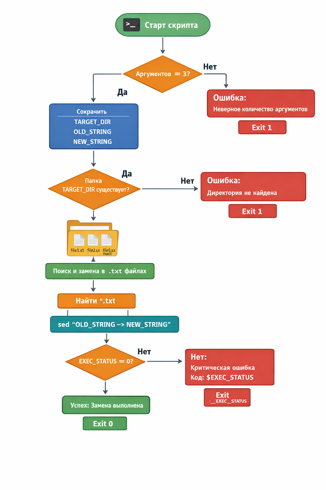
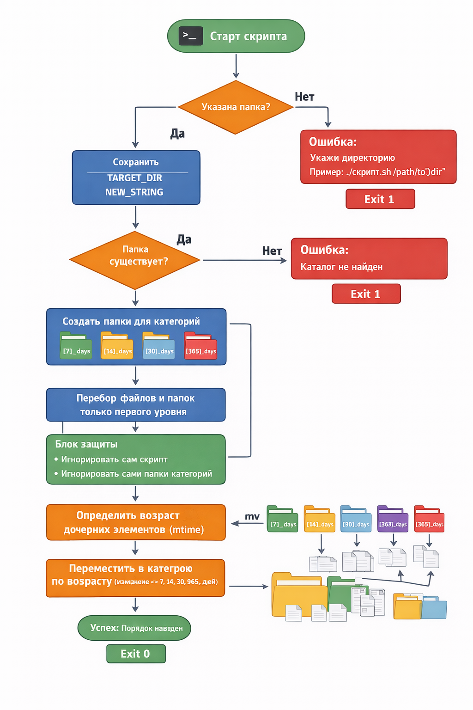

📂 Bash Automation Scripts
Набор Bash-скриптов для автоматизации работы с файлами:
1.	Text Replacer — массовая замена текста во всех .txt файлах указанной директории.
2.	Smart File Sorter — автоматическая сортировка файлов и папок по возрасту последнего изменения.
📋 Содержание
·	Описание проектов
·	Скрипт 1 — Text Replacer
·	Скрипт 2 — Smart File Sorter
·	Установка
·	Запуск в Windows
·	Запуск в Linux
·	Запуск в macOS
Описание проектов
Проект демонстрирует использование Bash для решения практических задач:
✅ Работа с аргументами командной строки
✅ Проверка пользовательского ввода
✅ Обработка файловой системы
✅ Использование команд find, sed, stat, mv
✅ Автоматизация рутинных операций
Скрипт 1 — Text Replacer
Возможности
Скрипт выполняет поиск и замену текста во всех файлах с расширением .txt внутри указанной директории и её поддиректорий.
Что делает скрипт
1.	Проверяет количество аргументов.
2.	Проверяет существование директории.
3.	Ищет все .txt файлы.
4.	Выполняет замену текста через sed.
5.	Проверяет код завершения операции.
6.	Выводит сообщение об успехе или ошибке.
Блок-схема работы
Поместите изображение в папку images/laba_6.png

Использование
./laba_6.sh "/path/to/folder" "старый_текст" "новый_текст"

Пример
./laba_6.sh "./documents" "Hello" "Hi"

После выполнения все найденные совпадения будут заменены.
Скрипт 2 — Smart File Sorter
Возможности
Скрипт автоматически сортирует файлы и папки по возрасту последнего изменения.
Создаются следующие категории:
Категория	Возраст
[7]_days	до 7 дней
[14]_days	до 14 дней
[30]_days	до 30 дней
[90]_days	до 90 дней
[365]_days	до 365 дней
[365+]_days	более года
Логика работы
Скрипт:
7.	Проверяет корректность аргументов.
8.	Проверяет существование директории.
9.	Создаёт папки-категории.
10.	Получает дату изменения каждого файла и папки.
11.	Вычисляет возраст объекта.
12.	Определяет нужную категорию.
13.	Перемещает объект в соответствующую папку.
14.	Защищает:
o	сам скрипт;
o	папки категорий;
o	уже отсортированные элементы.
Блок-схема работы
Поместите изображение в папку images/mega_sort.png

Использование
./mega_sort.sh "/path/to/folder"

Пример
./mega_sort.sh "/home/user/Downloads"

После выполнения структура может выглядеть так:
Downloads/
│
├── [7]_days/
├── [14]_days/
├── [30]_days/
├── [90]_days/
├── [365]_days/
└── [365+]_days/

Установка
Склонируйте репозиторий:
git clone https://github.com/USERNAME/REPOSITORY.git

Перейдите в каталог проекта:
cd REPOSITORY

Выдайте права на выполнение:
chmod +x laba_6.sh
chmod +x mega_sort.sh

Запуск в Linux
Проверьте наличие Bash:
bash --version

Запуск:
./laba_6.sh "директория" "старое" "новое"

или
./mega_sort.sh "директория"

Запуск в macOS
Bash уже установлен в системе.
Проверьте:
bash --version

Сделайте скрипты исполняемыми:
chmod +x *.sh

Запуск аналогичен Linux:
./laba_6.sh "директория" "старое" "новое"
./mega_sort.sh "директория"

Запуск в Windows
Рекомендуемые варианты:
Git Bash
Установить:
https://git-scm.com/download/win
Запуск:
./laba_6.sh "/c/Users/User/Documents" "old" "new"
./mega_sort.sh "/c/Users/User/Documents"

WSL (Windows Subsystem for Linux)
Установка:
wsl --install

После установки:
chmod +x *.sh
./laba_6.sh ...

или
./mega_sort.sh ...

Используемые технологии
·	Bash
·	GNU sed
·	GNU find
·	stat
·	mv
·	chmod
Автор
Проект создан для изучения Bash, автоматизации работы с файлами и практики системного программирования.

